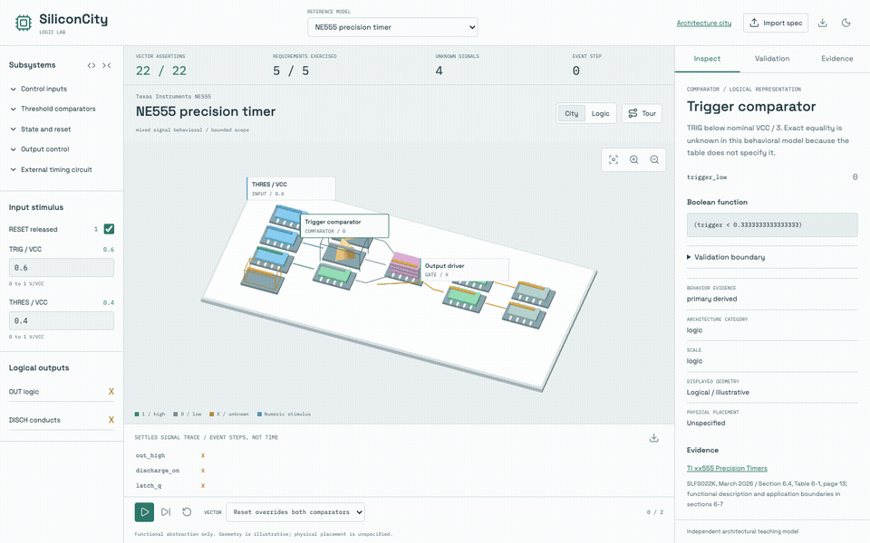
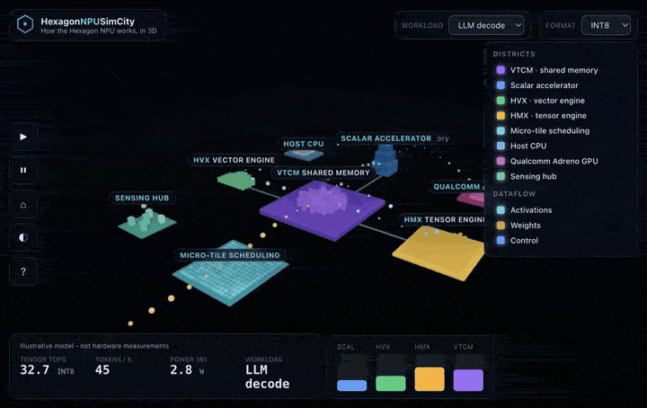
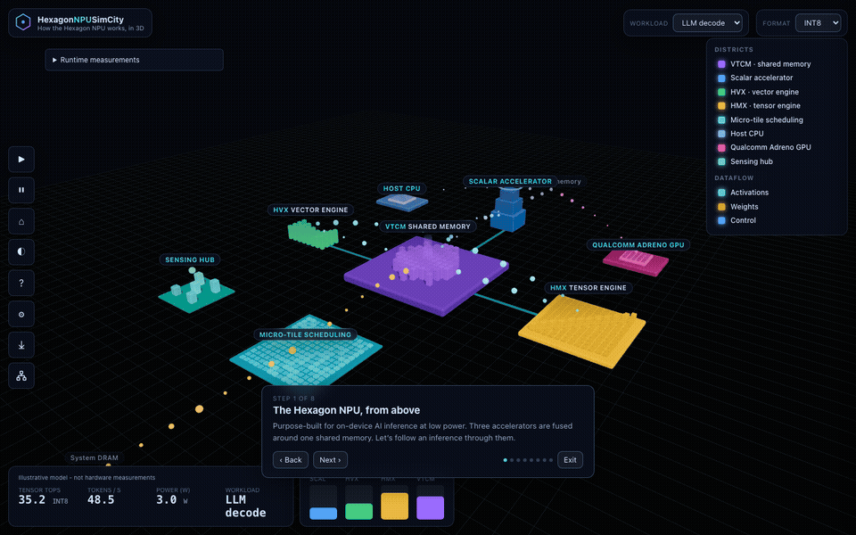
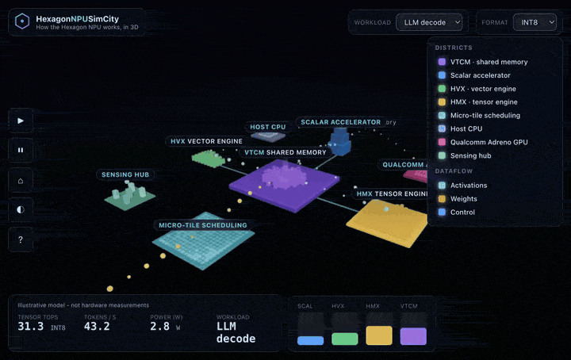
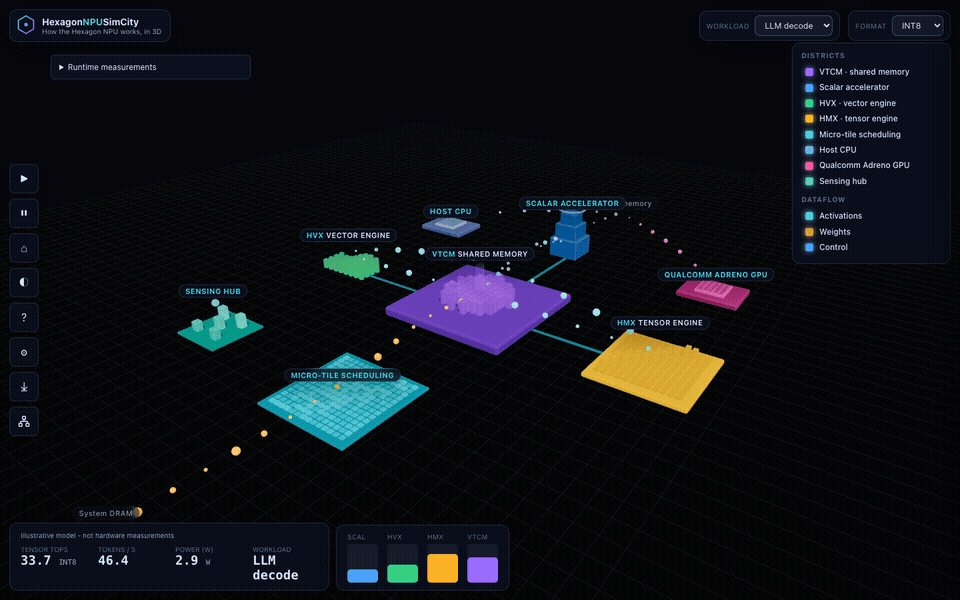

# SiliconCity

SiliconCity combines an architectural city with a source-linked **Logic Lab** for
declarative chip and subsystem models. The existing Hexagon explorer remains at
the site root; the new lab is [logic.html](logic.html), also linked from its toolbar.

## Specification-Driven Logic Lab



- Expand and collapse subsystem diagrams, including nested groups.
- Filter the reference catalog by device class, from discrete logic to FPGA.
- Inspect equations, source references, evidence classifications, assumptions,
  and explicitly unmodeled boundaries.
- Expand local Boolean truth tables into components inside the logic diagram.
- Change inputs, replay independent validation vectors, inspect event-step traces,
  and import/export data-only JSON specifications.
- Pulse explicit clocks and separate evaluated signals from source-linked
  architectural connections that do not execute.
- Use a shared Boolean/state engine and graph for both 3D and logic views.

| Class | Reference example | Executable scope |
| --- | --- | --- |
| Component | TI NE555 | Nominal comparator, reset/trigger, and retained output logic |
| Component | TI SN74HC00 | Four independent NAND gates |
| CPU / ISA | Generic RV32I | BEQ/BNE decode and branch decision |
| MCU | STM32F103C8 | EXTI selection, masks, and bounded exception eligibility |
| MPU | NXP i.MX 6ULL | GIC forwarding and effective priority-mask comparison |
| NPU | NVIDIA NVDLA v1 | CSB request/bank contracts and interrupt masking |
| FPGA | AMD Artix 7 primitive network | LUT6, clock-enabled registers, carry chain, and example route mux |

They are scoped functional abstractions, not electrical simulators or complete
chip/ISA implementations. Larger models retain memory, compute, peripheral,
configuration, and I/O context as explicitly unexecuted boundaries. FPGA
primitive equations use a fingerprinted open-source implementation; no vendor
bitstream or hardware timing is simulated. Unspecified startup state and
unsupported behavior remain `X`. The requested `QC 477M` product identity has
not been verified.

```bash
npm ci
npm run dev
# Open /logic.html on the printed local URL.
npm run validate:specs
npm run test:logic
```

Start with [AGENTS.md](AGENTS.md) to extend the atlas with an agent, and the
[model authoring and verification guide](docs/logic-lab.md) for the schema,
semantics, provenance rules, limitations, and validation workflow. The agent
transcribes and verifies primary sources; the browser does not automatically
convert a datasheet PDF into a proven chip implementation.

The [cross-vendor roadmap](README.md.txt) guides future architecture work.
Its complete vendor maps and physical floorplans are not implied by these
bounded subsystem examples.

## Hexagon Architecture City

**Walk through the Qualcomm Hexagon NPU. Watch a tensor flow. Understand on-device AI.**

An explorable 3D model where districts are the parts of the Hexagon™ NPU and
motion is the dataflow between them. Follow an inference from weights in memory,
through the scalar, vector and tensor accelerators fused around a shared memory,
and back out again.

No installation to explore — it runs in a browser with WebGL2. View here: https://eoinjordan.github.io/SiliconCity/
### The NPU at a glance

Districts are NPU components; the moving particles are the dataflow (cyan activations, orange weights from DRAM). Press `N` to swing between night and day.



### Guided tour

Press `T` to follow one inference through the fused pipeline — the camera glides between districts and explains each one.




> **Independent & non-commercial.** Not affiliated with, sponsored by, or endorsed
> by Qualcomm. Hexagon, Snapdragon, Adreno and Oryon are trademarks of Qualcomm
> Incorporated. Every number shown is **illustrative** and scaled to be readable —
> a teaching model, **not** a datasheet or a measurement of any real silicon.

Inspired by [PGSimCity](https://github.com/NikolayS/PGSimCity), which does the
same thing for PostgreSQL.

## Native and measured runtimes

Android ARM64 and Windows ARM64 shells can run a small, output-checked ONNX
arithmetic workload with explicit CPU/QNN selection. The default Android preview
is CPU-only; a QNN-enabled build requires matching SDK libraries. Windows has a
QNN-backed build and MSI packaging workflow. Actual Snapdragon execution and MSI
installation still require target-device verification.

Ollama, llama.cpp and LM Studio adapters provide separate measured timings through
an opt-in local service, never inferred NPU utilization. See the
[native and runtime guide](docs/native.md) for build commands, release automation,
security boundaries and limitations.

Android example source:
[edgeimpulse/example-android-inferencing](https://github.com/edgeimpulse/example-android-inferencing)
and its [QNN example](https://github.com/edgeimpulse/example-android-inferencing/tree/main/qnn-hardware-acceleration).

## See it in motion

> Recorded from the running app. Everything on screen is **illustrative** (a teaching model), not a hardware measurement.


### Quantization / precision

Switch **format** (INT4 → INT8 → INT16 → FP16) and the HMX *Tensor TOPS* and *tokens/s* readouts scale with the chosen precision — this is how the model represents quantization. The coefficients are illustrative; the arithmetic of integer affine quantization is verified separately in [docs/verification.md](docs/verification.md).



### Workloads under different conditions

Switch **workload** — LLM decode, Vision / conv, Idle — and watch the scalar, HVX and HMX utilisation bars and the accelerators themselves respond.



## Quick start

```bash
npm install
npm run dev      # open the printed localhost URL
```

```bash
npm run build      # production build to dist/
npm run preview    # serve the built site
npm run typecheck  # tsc --noEmit
npm test           # module unit and component integration tests
npm run test:coverage
npm run test:browser # real WebGL component tests (install Chromium first)
npm run test:app     # production app tests under a Pages-style subpath
```

## What you are looking at

| District | What it is |
|---|---|
| **VTCM** (centre, violet) | Vector Tightly-Coupled Memory — NPU-local memory that keeps working tiles close to the engines so they share data without constant DRAM traffic. |
| **Scalar accelerator** (north, blue) | Control flow and orchestration: sequences the other engines and runs the parts of a model that aren't big matrix math. |
| **HVX** (west, green) | The Hexagon Vector eXtensions SIMD engine — activations, normalisation and elementwise work between matrix multiplies. |
| **HMX** (east, amber) | The Hexagon Matrix eXtensions tensor engine — a multiply-accumulate array for convolutions and matmuls. Most of the TOPS live here. |
| **Micro-tile scheduling** (south, cyan) | A *scheduling concept*, not a separate block: large ops are split into tiles that fit local memory and reuse data. |
| **Host CPU / Adreno GPU / Sensing hub** (corners) | System context *outside* the NPU. Shown to place the NPU in the wider Qualcomm AI Engine, not simulated as consumers of VTCM. |

Colour is meaning, never decoration: **scalar is blue**, **HVX is green**,
**HMX is amber**, **VTCM is violet**, **activations are cyan**, **weights are
orange**, and system-context labels are drawn quieter and dashed.

## Controls

Drag to orbit, wheel/pinch to zoom, Shift-drag to pan, click a district to
inspect it. Press **?** for the full key map and colour legend.

| Key | Action | Key | Action |
|---|---|---|---|
| `T` | Guided tour | `N` | Day / night |
| `K` / `P` | Pause / resume | `R` | Reset |
| `H` | Establishing shot | `1` `2` `3` | LLM / Vision / Idle workload |
| `?` | Keys & legend | `Esc` | Close overlay |

Try switching **precision** (INT4 → FP16) and watch the tensor engine's TOPS and
the token rate change, or run the **Vision / conv** workload and watch HMX light up.

## How much to trust this

The city is a **model, not an emulator**. The 3D city, the utilisation bars and the
throughput figures are scaled to make the architecture observable. The simulation
is a small deterministic behaviour model (`src/sim/`); it does not execute any real
Hexagon workload and its numbers should not be cited as performance data. Optional
native workload and local-runtime measurements are separately labelled and are
not used to claim measured values for the city's utilization or power meters.

Architecture background is drawn from Qualcomm's public description of the Hexagon
NPU (fused scalar + vector + tensor accelerators, a large shared memory, and
micro-tile inferencing within the heterogeneous Qualcomm AI Engine).

See the [calculation and quantization verification](docs/verification.md) for
primary sources, executable ONNX reference examples, integer ranges, storage
calculations and the boundary between verified arithmetic and unverified hardware
performance. Format labels are not a universal Hexagon support matrix; FP16 and
integer quantization are different, and real models need calibration and testing.

## References & sources

The district model (fused scalar + vector + tensor accelerators around a large shared
memory, micro-tile inferencing, and the heterogeneous Qualcomm AI Engine) is drawn from
Qualcomm's public materials. The on-screen figures are **not** taken from these sources —
see [docs/verification.md](docs/verification.md) for the source-by-source audit and the
verified integer-quantization examples.

**Qualcomm — Hexagon NPU & AI Engine**
- [Qualcomm Hexagon NPU](https://www.qualcomm.com/processors/hexagon) — primary reference for the districts and dataflow.
- [Qualcomm AI Engine](https://www.qualcomm.com/products/technology/processors/ai-engine) — heterogeneous CPU + GPU + NPU.
- [Qualcomm AI (overview)](https://www.qualcomm.com/artificial-intelligence)
- [Qualcomm Oryon CPU](https://www.qualcomm.com/processors/oryon) · [Qualcomm Adreno GPU](https://www.qualcomm.com/processors/adreno)
- [Qualcomm AI Hub](https://aihub.qualcomm.com/)

**Qualcomm — platform figures & quantization workflow** (used only in the verification notes, clearly labelled illustrative vs. cited)
- [Snapdragon X Elite](https://www.qualcomm.com/laptops/products/snapdragon-x-elite) and its [product brief (87-71417-1 Rev F, PDF)](https://docs.qualcomm.com/doc/87-71417-1/87-71417-1_REV_F_Snapdragon_X_Elite_Product_Brief.pdf) — the “up to 45 TOPS” figure.
- [AI Hub quantization guide](https://workbench.aihub.qualcomm.com/docs/hub/quantize_examples.html) and [profiling guide](https://workbench.aihub.qualcomm.com/docs/hub/profile_examples.html) — weight/activation precision choices and HTP FP16 support caveats.

**Quantization semantics**
- ONNX [QuantizeLinear](https://onnx.ai/onnx/operators/onnx__QuantizeLinear.html) / [DequantizeLinear](https://onnx.ai/onnx/operators/onnx__DequantizeLinear.html) — the integer affine model reproduced in [`src/sim/quantization.ts`](src/sim/quantization.ts).

## Project layout

```
src/
  core/     types, palette, math utilities, event bus
  sim/      the behaviour model + fixed-step clock (+ tests)
  engine/   renderer, camera rig, CSS2D labels, dataflow, picking
  world/    the districts: ground, VTCM, accelerators, tiling, system context
  ui/       HUD, inspector, guided tour, help overlay, keyboard controls
  main.ts   boot + wiring
```

## License

[Apache-2.0](LICENSE). See [NOTICE](NOTICE) for trademarks and the model disclaimer.
